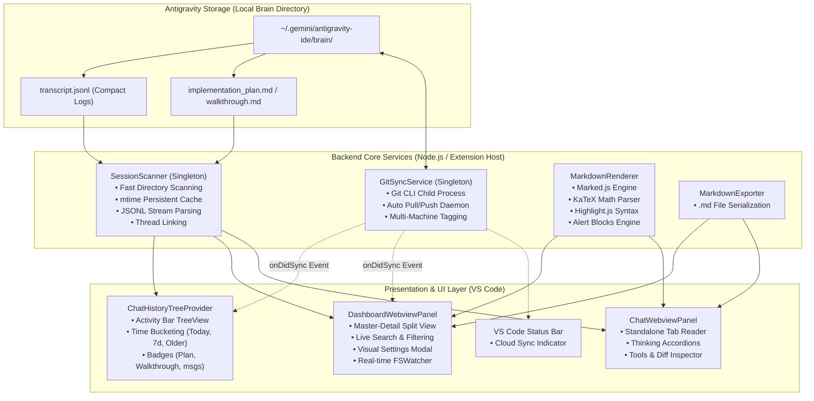

# Architecture & Developer Guide
## Brain Hub for Antigravity for VS Code & Antigravity IDE

This document provides a technical overview of the codebase architecture, design patterns, internal subsystems, and guidelines for developers who want to extend, maintain, or contribute to **Brain Hub for Antigravity**.

---

## Table of Contents
1. [High-Level Architecture](#1-high-level-architecture)
2. [Project Structure](#2-project-structure)
3. [Core Subsystems & Implementation Details](#3-core-subsystems--implementation-details)
   - [3.1. Storage Engine & Log Format](#31-storage-engine--log-format)
   - [3.2. SessionScanner & Indexing Cache Engine](#32-sessionscanner--indexing-cache-engine)
   - [3.3. GitSyncService & Multi-Device Synchronization](#33-gitsyncservice--multi-device-synchronization)
   - [3.4. MarkdownRenderer & Mathematical Engine](#34-markdownrenderer--mathematical-engine)
   - [3.5. Webview Bridge & Real-Time Live Watcher](#35-webview-bridge--real-time-live-watcher)
   - [3.6. Sidebar TreeView Provider](#36-sidebar-treeview-provider)
4. [Data Models & Type Definitions](#4-data-models--type-definitions)
5. [Development & Workflow Guidelines](#5-development--workflow-guidelines)
   - [5.1. Prerequisites & Environment Setup](#51-prerequisites--environment-setup)
   - [5.2. Build, Watch & Packaging Scripts](#52-build-watch--packaging-scripts)
   - [5.3. Debugging with Extension Host](#53-debugging-with-extension-host)
   - [5.4. Architectural Principles & Coding Standards](#54-architectural-principles--coding-standards)
6. [Extending the Extension (Step-by-Step Guide)](#6-extending-the-extension-step-by-step-guide)
7. [Future Roadmap & Extension Points](#7-future-roadmap--extension-points)

---

## 1. High-Level Architecture

The extension is designed with a **modular, service-oriented architecture** separating data discovery, synchronization, state caching, and presentation layers:



---

## 2. Project Structure

```text
brain-hub-antigravity/
├── .vscode/                      # VS Code debug configurations (launch.json, tasks.json)
├── media/                        # Static assets (icon.svg, images)
├── src/                          # TypeScript source code
│   ├── extension.ts              # Extension entry point & lifecycle management
│   ├── models/
│   │   └── types.ts              # Core TypeScript interfaces & type definitions
│   ├── providers/
│   │   └── ChatHistoryTreeProvider.ts # TreeDataProvider for Sidebar TreeView
│   ├── services/
│   │   ├── SessionScanner.ts     # Scanning, JSONL parsing, metadata extraction, index cache
│   │   ├── GitSyncService.ts     # Git automation, background sync, multi-device tags
│   │   ├── MarkdownRenderer.ts   # Marked + KaTeX + Highlight.js HTML renderer
│   │   ├── MarkdownExporter.ts   # Exporter to clean .md documents
│   │   ├── KaTeXStyles.ts        # Self-contained bundled KaTeX CSS
│   │   └── HighlightStyles.ts    # Self-contained bundled Highlight.js Dark Theme CSS
│   └── views/
│       ├── ChatWebviewPanel.ts   # Standalone Webview transcript viewer
│       └── DashboardWebviewPanel.ts # Full-page Master-Detail Brain Hub Dashboard
├── esbuild.js                    # Esbuild bundling configuration
├── package.json                  # Extension manifest, contributes, commands, configurations
├── tsconfig.json                 # TypeScript compiler configuration
├── README.md                     # Main GitHub & Marketplace documentation (English)
├── README_VI.md                  # Vietnamese documentation
├── USER_GUIDE.md                 # Full user guide (English)
├── USER_GUIDE_VI.md              # Full user guide (Vietnamese)
└── ARCHITECTURE.md               # Developer and architecture guide (This file)
```

---

## 3. Core Subsystems & Implementation Details

### 3.1. Storage Engine & Log Format
Google DeepMind Antigravity IDE stores sessions locally inside:
- **Windows**: `C:\Users\<User>\.gemini\antigravity-ide\brain\<sessionId>`
- **macOS / Linux**: `~/.gemini/antigravity-ide/brain/<sessionId>`

#### Session Directory Layout:
```text
<brainDir>/<sessionId>/
├── .system_generated/
│   └── logs/
│       ├── transcript.jsonl      # Compact JSONL transcript (1 line per step)
│       └── transcript_full.jsonl # Complete untruncated transcript
├── implementation_plan.md        # [Optional] Planning artifact
├── walkthrough.md                # [Optional] Walkthrough artifact
└── metadata.json                 # [Optional] Task metadata
```

Each line in `transcript.jsonl` is a JSON object with:
- `step_index`: Step order in trajectory.
- `source`: `'USER_EXPLICIT'`, `'MODEL'`, or `'SYSTEM'`.
- `type`: `'USER_INPUT'`, `'PLANNER_RESPONSE'`, `'RUN_COMMAND'`, `'SUBAGENT_NOTIFICATION'`, etc.
- `content`: Prompt or response text.
- `tool_calls`: Array of `{ name, args, status, exitCode, output }`.

---

### 3.2. SessionScanner & Indexing Cache Engine
Located in [`src/services/SessionScanner.ts`](./src/services/SessionScanner.ts).

- **Design Pattern**: Singleton (`SessionScanner.getInstance()`).
- **Persistent Disk Index Cache (`sessions_index_cache.json`)**:
  - Scanning thousands of multi-megabyte `transcript.jsonl` files on every keystroke or reload is computationally prohibitive.
  - `SessionScanner` stores parsed metadata in `sessions_index_cache.json` located in `context.globalStorageUri`.
  - **Cache Invalidation**: Validates `mtime` (last modified timestamp) of the directory and `transcript.jsonl`. If `mtime` matches the cache, it reuses the cached `ChatSession` metadata instantly. If changed or new, it parses only that specific session.
- **Thread & Hierarchy Linking**:
  - Detects subagents and child sessions by tracking `sessionOriginId` and `parentId`.
  - Computes `ConversationThread` objects grouping parent sessions and their spawned subagents.
- **Workspace & Machine Detection**:
  - Parses workspace roots from system initialization prompts.
  - Labels sessions with the current machine's hostname or user-defined `machineName`.

---

### 3.3. GitSyncService & Multi-Device Synchronization
Located in [`src/services/GitSyncService.ts`](./src/services/GitSyncService.ts).

- **Design Pattern**: Singleton (`GitSyncService.getInstance()`).
- **Mechanism**:
  - Executes native Git CLI child processes inside the `brain/` directory.
  - Automatically commits changes with a standardized format: `Auto-sync: <machineName> at <timestamp>`.
  - Uses `git pull --rebase` and `git push` to guarantee linear history across multiple computers.
- **Safety Guards**:
  - `isSyncing` mutex lock to prevent race conditions from concurrent timers or manual clicks.
  - Emits `onDidSync` event to trigger non-blocking UI refreshes across the Sidebar and Dashboard.
- **Lifecycle Integration**:
  - Triggered automatically on startup (`autoSyncOnStartup`).
  - Runs periodically via `NodeJS.Timeout` (`autoSyncIntervalMinutes`).

---

### 3.4. MarkdownRenderer & Mathematical Engine
Located in [`src/services/MarkdownRenderer.ts`](./src/services/MarkdownRenderer.ts).

- **Completely Offline-First**: No external CDN scripts.
- **Bundled Assets**:
  - **KaTeX** math engine + bundled CSS via [`KaTeXStyles.ts`](./src/services/KaTeXStyles.ts).
  - **Highlight.js** syntax highlighter + dark theme CSS via [`HighlightStyles.ts`](./src/services/HighlightStyles.ts).
- **Custom Tokenizer & Alert Processor**:
  - Replaces GitHub-style alert markers (`[!NOTE]`, `[!TIP]`, `[!IMPORTANT]`, `[!WARNING]`, `[!CAUTION]`) with styled UI callout containers.
  - Injects a `Copy` button into all `<pre><code>` code blocks.

---

### 3.5. Webview Bridge & Real-Time Live Watcher
Located in [`src/views/DashboardWebviewPanel.ts`](./src/views/DashboardWebviewPanel.ts) and [`src/views/ChatWebviewPanel.ts`](./src/views/ChatWebviewPanel.ts).

- **Two-Way Communication Protocol**:
  - **Webview $\rightarrow$ Host**: `vscode.postMessage({ command: '...', ... })` $\rightarrow$ handled in `panel.webview.onDidReceiveMessage`.
  - **Host $\rightarrow$ Webview**: `this.panel.webview.postMessage({ command: '...', ... })`.
- **Live File Watcher (`fs.FSWatcher`)**:
  - When viewing a session, an `fs.watch` is attached to its `transcript.jsonl`.
  - When Antigravity appends new messages, the watcher triggers an incremental re-render with debounce (`reloadDebounceTimer`) to update the active viewer.

---

### 3.6. Sidebar TreeView Provider
Located in [`src/providers/ChatHistoryTreeProvider.ts`](./src/providers/ChatHistoryTreeProvider.ts).

- Implements `vscode.TreeDataProvider<SessionTreeItem | TimeGroupTreeItem>`.
- Buckets sessions dynamically into:
  - `Today` (midnight today to now)
  - `Yesterday` (midnight yesterday to midnight today)
  - `Previous 7 Days` (7 days ago to yesterday)
  - `Older` (older than 7 days)
- Applies dynamic icons (`ThemeIcon('calendar')`, `ThemeIcon('bookmark')`, `ThemeIcon('git-commit')`).

---

## 4. Data Models & Type Definitions

Located in [`src/models/types.ts`](./src/models/types.ts):

```typescript
export interface ToolCallInfo {
  name: string;
  args?: Record<string, any> | string;
  status?: string;
  exitCode?: number;
  output?: string;
  description?: string;
}

export interface ChatMessage {
  index: number;
  userIndex?: number;
  source: 'USER_EXPLICIT' | 'MODEL' | 'SYSTEM' | string;
  type: 'USER_INPUT' | 'PLANNER_RESPONSE' | 'SUBAGENT_NOTIFICATION' | 'CHECKPOINT' | 'RUN_COMMAND' | string;
  status?: string;
  content: string;
  cleanContent: string;
  thinking?: string;
  toolCalls?: ToolCallInfo[];
  mediaAttachments?: string[];
  createdAt?: string;
  timestamp?: Date;
  truncatedFields?: string[];
  sessionOriginId?: string;
}

export interface ChatSession {
  id: string;
  path: string;
  title: string;
  firstPrompt: string;
  lastModified: Date;
  createdAt?: Date;
  messageCount: number;
  userPromptCount: number;
  workspaceName?: string;
  workspacePath?: string;
  machineName?: string;
  hasArtifacts: boolean;
  planPath?: string;
  walkthroughPath?: string;
  parentId?: string;
  rootId?: string;
  childIds?: string[];
  threadTitle?: string;
  isEmpty?: boolean;
}
```

---

## 5. Development & Workflow Guidelines

### 5.1. Prerequisites & Environment Setup
- **Node.js**: `v20.x` or higher
- **npm**: `v10.x` or higher
- **VS Code**: `v1.80.0` or higher (or Antigravity IDE)

```bash
# Clone the repository
git clone https://github.com/hungle-vn/brain-hub-antigravity.git
cd brain-hub-antigravity

# Install dependencies
npm install
```

---

### 5.2. Build, Watch & Packaging Scripts

| Command | Action |
|---|---|
| `npm run compile` | Compiles TypeScript source files with `tsc -p ./` |
| `npm run watch` | Watches TypeScript files and recompiles incrementally |
| `npm run build` | Bundles and minifies source code into `./dist/extension.js` via `esbuild` |
| `npm run package` | Builds the production bundle and packages into a `.vsix` archive |

#### Esbuild Bundling Config ([`esbuild.js`](./esbuild.js)):
```javascript
const esbuild = require('esbuild');

esbuild.build({
  entryPoints: ['src/extension.ts'],
  bundle: true,
  outfile: 'dist/extension.js',
  external: ['vscode'], // VS Code API must remain external
  format: 'cjs',
  platform: 'node',
  target: 'node20',
  sourcemap: true,
  minify: process.argv.includes('--minify')
}).catch(() => process.exit(1));
```

---

### 5.3. Debugging with Extension Host
1. Open the project folder in VS Code.
2. Open the **Run and Debug** panel (`Ctrl + Shift + D`).
3. Select **"Run Extension"** and press `F5`.
4. An *Extension Development Host* window will open. You can set breakpoints directly in TypeScript files in `src/`.
5. To reload changes after modifying webviews or TypeScript, use `Ctrl + R` in the Host window or restart the debug session (`Ctrl + Shift + F5`).

---

### 5.4. Architectural Principles & Coding Standards

1. **Offline-First & No Remote CDNs**:
   - All styling, fonts, KaTeX formulas, and scripts must be bundled locally or rendered statically.
   - Do not load scripts via external `<script src="https://...">` tags.

2. **Non-Blocking Asynchronous Operations**:
   - File I/O for logs, cache files, and Git processes must be asynchronous or debounced.
   - Parsing tasks should leverage `SessionScanner`'s persistent memory and disk cache.

3. **Strict Type Safety**:
   - Use explicit TypeScript types. Avoid using `any` unless dealing with arbitrary JSON payloads from external tool calls.

4. **Webview Security & CSP**:
   - Maintain strict Content Security Policies (`default-src 'none'; img-src ${webview.cspSource} https: data:; script-src 'unsafe-inline' ...`).

5. **Cross-Platform Path Handling**:
   - Always use `path.join()`, `path.normalize()`, and handle Windows drive letters and POSIX paths uniformly.

---

## 6. Extending the Extension (Step-by-Step Guide)

### Example A: Adding a New Command
1. Define the command in [`package.json`](./package.json) under `contributes.commands`:
   ```json
   {
     "command": "brainHub.myNewFeature",
     "category": "Brain Hub",
     "title": "My New Feature",
     "icon": "$(sparkle)"
   }
   ```
2. Register the command handler in [`src/extension.ts`](./src/extension.ts):
   ```typescript
   context.subscriptions.push(
     vscode.commands.registerCommand('brainHub.myNewFeature', async () => {
       vscode.window.showInformationMessage('Hello from My New Feature!');
     })
   );
   ```

### Example B: Adding an Action to the Webview Dashboard
1. In [`src/views/DashboardWebviewPanel.ts`](./src/views/DashboardWebviewPanel.ts), add a button in the HTML generation method:
   ```html
   <button class="action-btn" onclick="triggerCustomAction('${session.id}')">
     Custom Action
   </button>
   ```
2. In the Webview client JavaScript block:
   ```javascript
   function triggerCustomAction(sessionId) {
     vscode.postMessage({ command: 'customAction', sessionId: sessionId });
   }
   ```
3. In `DashboardWebviewPanel.ts` message listener:
   ```typescript
   case 'customAction':
     await this.handleCustomAction(message.sessionId);
     break;
   ```

---

## 7. Future Roadmap & Extension Points

- [ ] **AI-Powered Session Semantic Search**: Vector embeddings with local on-device small models for similarity search.
- [ ] **Custom Tagging / Labeling System**: Allow users to attach tags (e.g. `#bugfix`, `#refactoring`).
- [ ] **Session Branching / Forking**: Fork an existing conversation trajectory at a specific turn.
- [ ] **PDF / HTML Export**: Expand the exporter beyond Markdown to print-ready PDF and standalone single-file HTML reports.
- [ ] **VS Code Workspace State Sync**: Synchronize pinned sessions across team members.

---

## Contributing

Contributions, bug reports, and pull requests are welcome.
- Please open an issue on [GitHub Issues](https://github.com/hungle-vn/brain-hub-antigravity/issues) before submitting large pull requests.
- Ensure your changes build cleanly with `npm run compile` and `npm run build`.
