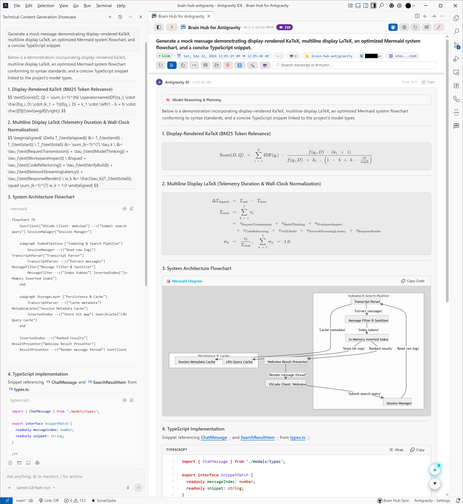

# Brain Hub for Antigravity

<p align="center">
  <a href="./README.md"><b>English</b></a> | <a href="./README_VI.md"><b>Tiếng Việt</b></a>
</p>

<p align="center">
  <a href="https://marketplace.visualstudio.com/items?itemName=chiriforge.brain-hub-antigravity"></a>
  <a href="https://open-vsx.org/extension/chiriforge/brain-hub-antigravity"></a>
  <a href="https://github.com/chiriforge/brain-hub-antigravity/releases"></a>
  <a href="LICENSE"></a>
  <a href="https://code.visualstudio.com/"></a>
</p>

Tiện ích mở rộng cho VS Code và Google DeepMind Antigravity IDE dùng để duyệt, tìm kiếm, khôi phục, lưu trữ tài liệu và đồng bộ các phiên làm việc Antigravity Brain giữa các máy tính.

[Visual Studio Marketplace](https://marketplace.visualstudio.com/items?itemName=chiriforge.brain-hub-antigravity) | [Open VSX Registry](https://open-vsx.org/extension/chiriforge/brain-hub-antigravity) | [Hướng Dẫn Sử Dụng (Tiếng Việt)](./USER_GUIDE_VI.md) | [User Guide (English)](./USER_GUIDE.md) | [Tài Liệu Kiến Trúc & Phát Triển](./ARCHITECTURE.md)

<p align="center">
  
  <br>
  <em>Hình 1: Khung chat mặc định của Antigravity IDE (bên trái) và Trình đọc Webview Brain Hub (bên phải).</em>
</p>

| Khả Năng Xử Lý | Khung Chat Mặc Định (Trái) | Trình Đọc Webview Brain Hub (Phải) |
|---|---|---|
| **Công thức Toán** | Cú pháp văn bản thô chưa render (`$$...$$`) | Render công thức KaTeX trực quan, căn chỉnh phương trình nhiều dòng |
| **Sơ đồ Hệ thống** | Khối mã nguồn Mermaid thô | Render trực tiếp thành sơ đồ vector SVG tương tác |
| **Khối Suy Luận** | Hiển thị dạng văn bản mở rộng | Khối thu gọn/mở rộng `Thinking` và `AI Steps` |
| **Thông Số Phiên** | Luồng tin nhắn cơ bản | Huy hiệu trạng thái Live, số bước thực thi, số tin nhắn người dùng, mốc timeline và thư mục workspace |
| **Thao Tác Phiên** | Không có | Thanh công cụ tích hợp đồng bộ Git, xuất tài liệu `.docs/`, tạo nhánh chat và nạp lại |

---

## Tính Năng

### 1. Bảng Điều Khiển Brain Hub Dashboard (`Ctrl + K Ctrl + D`)
- **Tìm kiếm & Lọc**: Lọc phiên chat theo tiêu đề, ID phiên, nội dung câu lệnh người dùng hoặc đường dẫn thư mục workspace.
- **Thao tác thanh tiêu đề**: Chạy lệnh đồng bộ Git, quét lại thư mục từ đĩa hoặc xóa các phiên chat rỗng.

### 2. Trình Đọc Chat Webview
- **Markdown & Công thức Toán**: Hiển thị định dạng GitHub Flavored Markdown và công thức LaTeX thông qua KaTeX.
- **Tô màu mã nguồn**: Khối mã hiển thị theo highlight.js kèm nút sao chép (Copy).
- **Sơ đồ Mermaid**: Tải script Mermaid khi phát hiện có khối sơ đồ trong phiên chat đang hiển thị.
- **Khối Alert**: Hỗ trợ các khối chú thích chuẩn GitHub (`[!NOTE]`, `[!TIP]`, `[!IMPORTANT]`, `[!WARNING]`, `[!CAUTION]`).
- **Khối thu gọn**: Cho phép đóng/mở phần suy luận của mô hình (`Thinking`), nhóm bước thực thi (`AI Steps`) và lệnh gọi công cụ (`Tools`).
- **Tìm kiếm trong hội thoại**: Tìm các đoạn văn bản trùng khớp bên trong phiên chat đang mở.
- **Tự động tải lại**: Theo dõi file `transcript.jsonl` của phiên đang xem và render lại khi có nội dung mới được ghi.

### 3. Sidebar Tree View
- **Lọc theo Workspace**: Giới hạn danh sách chỉ hiển thị các phiên chat gắn với thư mục dự án đang mở.
- **Huy hiệu thông tin**: Hiển thị số lượng tin nhắn, nhãn tên máy tính và trạng thái artifact đi kèm (`Plan`, `Walkthrough`).

### 4. Bộ Chuẩn Hóa Cú Pháp Mermaid (Mermaid Sanitizer)
- **Tự động xử lý cú pháp đồ thị**: Tiền xử lý mã nguồn sơ đồ Mermaid thô trước khi chuyển tới Mermaid.js:
  - Tự động bọc nhãn Node không có ngoặc kép vào dấu nháy kép cho các hình khối (hình chữ nhật `["..."]`, hình tròn `(("..."))`, hình trụ database `[("...")]`, lục giác `{{"..."}}`, hình thoi `{"..."}`).
  - Chuyển đổi các ký tự đặc biệt (`<`, `>`, `&`) trên nhãn cạnh `|...|` thành HTML entities (`&lt;`, `&gt;`, `&amp;`).
  - Chuẩn hóa khai báo Subgraph có chứa ký tự điều khiển thành dạng có nháy kép (`subgraph "..."`).

### 5. Lưu Trữ Tài Liệu Dự Án (.docs/)
- **Xuất vào Workspace**: Sao chép các file plan, walkthrough, sơ đồ và log chat vào thư mục `.docs/` ở gốc workspace.
- **Khử trùng dữ liệu nhạy cảm**: Khi bật, tự động tìm và ẩn API keys, bearer tokens, mật khẩu và private keys trong log xuất ra.
- **Bảo vệ qua Git**: Tự động thêm `.docs/logs/` và `.docs/scratch/` vào `.gitignore` để tránh commit log chat thô.
- **Xuất hàng loạt**: Xuất toàn bộ các phiên chat thuộc workspace hiện tại ra các file Markdown riêng lẻ.

### 6. Xem Trước Markdown Hỗ Trợ Mermaid & KaTeX
- Cung cấp lệnh `brainHub.openRichMarkdownPreview` trên các file `.md` trong Explorer và tab biên tập để xem trước nội dung có chứa sơ đồ Mermaid và công thức KaTeX.

### 7. Đồng Bộ Qua Git
- Khởi tạo và quản lý kho Git trong thư mục `brain/` cục bộ để push và pull dữ liệu với remote repository.
- **Nhận diện thiết bị**: Gắn nhãn `machineName` vào các phiên để phân biệt file tạo từ các máy tính khác nhau.
- **Tùy chọn đồng bộ**: Hỗ trợ đồng bộ thủ công, đồng bộ khi mở ứng dụng và đồng bộ định kỳ trong nền.
- **Hiển thị Status Bar**: Nút `$(github) Brain Hub Sync` ở thanh trạng thái dưới cùng hiển thị tình trạng đồng bộ.

### 8. Sao Chép Prompt Tiếp Tục Hội Thoại
- Sao chép mẫu prompt chứa ID phiên và đường dẫn file transcript vào clipboard để dán vào cửa sổ chat Antigravity mới.

### 9. Quản Lý Phiên Chat Rỗng
- **Ẩn phiên 0 tin nhắn**: Bật/tắt việc ẩn các phiên không có tin nhắn.
- **Xóa phiên rỗng**: Quét và xóa các thư mục phiên chat 0 tin nhắn khỏi ổ đĩa.

### 10. Giám Sát Thư Mục Lưu Trữ
- **Watcher thời gian thực**: Giám sát thư mục `brain/` để phát hiện các thư mục phiên chat được tạo mới hoặc bị xóa.
- **Làm mới khi focus cửa sổ**: Chạy quét nền cập nhật lại dữ liệu khi người dùng chuyển lại cửa sổ IDE.

---

## Cài Đặt

### Cài đặt từ Extension Marketplace (Khuyến nghị)
Cài đặt trực tiếp từ chợ tiện ích mở rộng của trình biên tập hoặc qua dòng lệnh CLI:
- **Visual Studio Marketplace**: [Cài đặt trên Visual Studio Marketplace](https://marketplace.visualstudio.com/items?itemName=chiriforge.brain-hub-antigravity)
- **Open VSX Registry**: [Cài đặt trên Open VSX Registry](https://open-vsx.org/extension/chiriforge/brain-hub-antigravity)

Cài đặt qua dòng lệnh:
```bash
code --install-extension chiriforge.brain-hub-antigravity
```

### Cài từ file `.vsix`
1. Tải file `.vsix` từ mục [Releases trên GitHub](https://github.com/chiriforge/brain-hub-antigravity/releases).
2. Trong VS Code, mở thẻ Extensions (`Ctrl + Shift + X`) $\rightarrow$ nhấn `...` $\rightarrow$ chọn **Install from VSIX...**.

Hoặc cài qua dòng lệnh:
```bash
code --install-extension brain-hub-antigravity-0.5.1.vsix
```

### Chạy từ mã nguồn
```bash
git clone https://github.com/chiriforge/brain-hub-antigravity.git
cd brain-hub-antigravity
npm install
npm run build
```
Nhấn `F5` trong VS Code để mở Extension Development Host.

---

## Phím Tắt

| Phím tắt (Windows/Linux) | Phím tắt (macOS) | Command ID | Mô tả |
|---|---|---|---|
| `Ctrl + K Ctrl + D` | `Cmd + K Cmd + D` | `brainHub.openDashboard` | Mở Brain Hub Dashboard |
| `Ctrl + K Ctrl + H` | `Cmd + K Cmd + H` | `brainHub.searchChat` | Mở Quick Search tìm kiếm phiên chat |

*Ghi chú: Toàn bộ phím tắt có thể tùy chỉnh hoặc tắt trong Keyboard Shortcuts (`Ctrl + K Ctrl + S`).*

---

## Danh Mục Lệnh (Commands Reference)

Tiện ích đăng ký các lệnh sau trong hệ thống:

| Lệnh | Tiêu đề | Mô tả |
|---|---|---|
| `brainHub.openDashboard` | Open Dashboard | Mở giao diện dashboard chia hai cột |
| `brainHub.searchChat` | Search Chat History... | Tìm kiếm QuickPick trên toàn bộ phiên chat |
| `brainHub.openSettings` | Open Settings | Mở cài đặt cấu hình của tiện ích trong VS Code |
| `brainHub.syncNow` | Sync with GitHub (Pull & Push) | Chạy git pull và git push cho thư mục brain |
| `brainHub.setupGitSync` | Setup GitHub Backup Repository... | Cấu hình remote URL cho thư mục brain |
| `brainHub.checkGitStatus` | Check GitHub Sync Status | Xem trạng thái nhánh và các thay đổi chưa commit |
| `brainHub.refresh` | Scan and Refresh Sessions from Disk | Quét lại thư mục brain và dựng lại cache |
| `brainHub.toggleWorkspaceFilter` | Filter Chat History by Current Workspace | Bật/tắt chế độ lọc phiên theo workspace |
| `brainHub.toggleHideEmptySessions` | Toggle Hide Empty Chats (0-message sessions) | Bật/tắt hiển thị phiên 0 tin nhắn |
| `brainHub.cleanEmptySessions` | Clean Empty Chat Sessions (0 messages) | Xóa thư mục các phiên 0 tin nhắn khỏi đĩa |
| `brainHub.exportMarkdown` | Export to Markdown (.md) | Lưu nội dung phiên chat hiện tại thành file .md |
| `brainHub.exportAllWorkspaceSessions` | Batch Export Workspace Sessions to Markdown... | Xuất toàn bộ phiên của workspace vào thư mục chọn |
| `brainHub.exportProjectDocs` | Archive Project Docs & Logs (.docs/) | Sao chép plan, walkthrough và log vào .docs/ |
| `brainHub.openRichMarkdownPreview` | Open Rich Markdown Preview (Mermaid & KaTeX) | Mở webview xem Markdown hỗ trợ Mermaid & KaTeX |
| `brainHub.openIdeMarkdownPreview` | Open with IDE Built-in Markdown Preview | Mở bằng trình xem trước Markdown mặc định |
| `brainHub.openChat` | Open Chat | Mở nội dung phiên chat trong tab đọc riêng |
| `brainHub.copyResumePrompt` | Copy Resume Prompt | Sao chép mẫu prompt tiếp tục phiên vào clipboard |
| `brainHub.copySessionId` | Copy Session ID | Sao chép chuỗi ID của phiên vào clipboard |
| `brainHub.openFolder` | Open Session Folder in Explorer | Mở thư mục chứa phiên chat trong trình quản lý file |
| `brainHub.deleteSession` | Delete Chat Session | Xác nhận và xóa thư mục phiên chat được chọn |

---

## Cấu Hình (Settings Reference)

Tùy chỉnh trong VS Code Settings (`Ctrl + ,` $\rightarrow$ tìm `brainHub`):

| Tên cấu hình | Mặc định | Mô tả |
|---|---|---|
| `brainHub.brainPath` | `""` | Đường dẫn chính tới thư mục `brain/` (mặc định: `~/.gemini/antigravity-ide/brain`) |
| `brainHub.additionalBrainPaths` | `[]` | Các đường dẫn bổ sung cần quét kết hợp với thư mục chính |
| `brainHub.machineName` | `""` | Nhãn tên máy cho phiên tạo tại máy này (mặc định lấy hostname) |
| `brainHub.sessionSortBy` | `"lastModified"` | Tiêu chí sắp xếp: `"lastModified"` (hoạt động cuối) hoặc `"createdAt"` (thời gian tạo) |
| `brainHub.messageOrder` | `"newestFirst"` | Thứ tự tin nhắn: `"newestFirst"` hoặc `"oldestFirst"` |
| `brainHub.autoSyncOnStartup` | `true` | Chạy đồng bộ Git khi khởi động VS Code |
| `brainHub.autoSyncIntervalMinutes` | `30` | Chu kỳ chạy ngầm đồng bộ Git tính bằng phút (`0` để tắt) |
| `brainHub.backgroundScanIntervalMinutes` | `5` | Chu kỳ quét ngầm thư mục brain tính bằng phút (`0` để tắt) |
| `brainHub.enableRealtimeWatcher` | `true` | Giám sát thư mục brain để phát hiện phiên mới hoặc bị xóa |
| `brainHub.autoRefreshOnWindowFocus` | `true` | Quét lại dữ liệu khi người dùng chuyển lại cửa sổ IDE |
| `brainHub.filterWorkspaceByDefault` | `false` | Mặc định lọc cây thư mục theo workspace khi khởi động |
| `brainHub.hideEmptySessions` | `true` | Ẩn các phiên chat có 0 tin nhắn |
| `brainHub.autoReloadOnLiveChat` | `true` | Nạp lại giao diện khi file transcript của phiên đang xem bị sửa đổi |
| `brainHub.defaultToolsState` | `"collapsed"` | Trạng thái mặc định của chi tiết lệnh gọi tool (`"collapsed"` hoặc `"expanded"`) |
| `brainHub.defaultAiStepsState` | `"collapsed"` | Trạng thái mặc định của nhóm bước AI (`"collapsed"` hoặc `"expanded"`) |
| `brainHub.defaultGroupExpansion` | `"smart"` | Chế độ mở rộng nhóm thời gian: `"smart"`, `"allExpanded"`, hoặc `"collapsed"` |
| `brainHub.maxQuickSearchItems` | `100` | Số lượng phiên tối đa được đánh chỉ mục cho Quick Search |
| `brainHub.autoOpenDashboardOnSidebarFocus` | `true` | Mở Dashboard khi nhấp vào icon Antigravity trên Activity Bar |
| `brainHub.archiver.defaultMode` | `"askEachTime"` | Chế độ lưu trữ: `"askEachTime"`, `"safeDocsOnly"`, hoặc `"fullWithSanitization"` |
| `brainHub.archiver.autoGitignore` | `true` | Thêm `.docs/logs/` và `.docs/scratch/` vào `.gitignore` |
| `brainHub.archiver.sanitizeSecrets` | `true` | Ẩn API keys, tokens và mật khẩu khỏi log transcript xuất ra |
| `brainHub.archiver.customSecretPatterns` | `[]` | Mẫu regex bổ sung dùng cho việc phát hiện thông tin nhạy cảm |

---

## Tài Liệu & Liên Kết Marketplace
- [Visual Studio Marketplace](https://marketplace.visualstudio.com/items?itemName=chiriforge.brain-hub-antigravity)
- [Open VSX Registry](https://open-vsx.org/extension/chiriforge/brain-hub-antigravity)
- [Hướng Dẫn Sử Dụng (Tiếng Việt)](./USER_GUIDE_VI.md)
- [User Guide (English)](./USER_GUIDE.md)
- [Tài Liệu Kiến Trúc & Phát Triển](./ARCHITECTURE.md)
- [Báo Lỗi / Đóng Góp](https://github.com/chiriforge/brain-hub-antigravity/issues)

---

## Tuyên bố miễn trừ trách nhiệm (Disclaimer)

**Brain Hub for Antigravity** là một tiện ích mở rộng mã nguồn mở độc lập, không chính thức. Tiện ích này không liên kết, không được tài trợ và không được xác nhận bởi Google hay Google DeepMind. "Antigravity", "Gemini" cùng các nhãn hiệu liên quan là tài sản của chủ sở hữu tương ứng, chỉ được sử dụng ở đây theo nguyên tắc Sử dụng hợp lý danh nghĩa (Nominative Fair Use) nhằm mô tả tính tương thích và công năng của công cụ.
